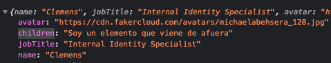

# Sección 4

## 24 Pasar propiedades, props, al componente hijo

````jsx
function Card(props) {
  return (
    <div className="Card">
    <div className="card">
    
    <div className="container">
    <h4><b>{props.name}</b></h4>
    <p>Architect & Engineer</p>
    </div>
    </div>
    </div>
    );
}

export default Card;
````

## 25 Pasar múltiples propiedades, props, al componente hijo

- Instalar faker: Librería para generar data dinámica localmente

```
npm install faker
```

- Importar faker en el archivo App.js y pasar la data dinámica al componente Card

````jsx
import './App.css';

import faker from 'faker';

import Card from './Card/Card';

function App() {
  return (
    <div className="App">
    <Card name={faker.name.firstName()} jobTitle={faker.name.jobTitle()} avatar={faker.image.avatar()}/>
    <Card name={faker.name.firstName()} jobTitle={faker.name.jobTitle()} avatar={faker.image.avatar()}/>
    <Card name={faker.name.firstName()} jobTitle={faker.name.jobTitle()} avatar={faker.image.avatar()}/>
    </div>
    );
}

export default App;
````

- En el componente hijo Card, usar la nueva data

```jsx
import './Card.css';

function Card(props) {
  return (
    <div className="Card">
    <div className="card">
    
    <div className="container">
    <h4><b>{props.name}</b></h4>
    <p>{props.jobTitle}</p>
    </div>
    </div>
    </div>
    );
}

export default Card;
```

## 26 Propiedad Children

- Al pasar algo entre las etiquetas, tag, de un componente, este componente recibe los datos

```jsx
import './App.css';

import faker from 'faker';

import Card from './Card/Card';

function App() {
  return (
    <div className="App">
    <Card name={faker.name.firstName()} jobTitle={faker.name.jobTitle()} avatar={faker.image.avatar()}>
    Soy un elemento que viene de afuera
    </Card>
    );
}

export default App;
```

- El componente Card, recibe lo siguiente en props



- Cards recibe esto como un props cualquiera

````jsx
import './Card.css';

function Card(props) {
  return (
    <div className="Card">
    <div className="card">
    
    <div className="container">
    <h4><b>{props.name}</b></h4>
    <p>{props.jobTitle}</p>
    <p>{props.children}</p>
      </div>
    </div>
    </div>
    );
}

export default Card;
````

### Pasar código via children

- Componente padre, App.js

```jsx
import './App.css';
import faker from 'faker';
import Card from './Card/Card';

function App() {
  return (
    <div className="App">
    <Card name={faker.name.firstName()} jobTitle={faker.name.jobTitle()} avatar={faker.image.avatar()}>
    <button className="button button2">Yes</button>
    <button className="button button3">No</button>
    </Card>
    <Card name={faker.name.firstName()} jobTitle={faker.name.jobTitle()} avatar={faker.image.avatar()}>
    <button className="button button2">Yes</button>
    <button className="button button3">No</button>
    </Card>

    <Card name={faker.name.firstName()} jobTitle={faker.name.jobTitle()} avatar={faker.image.avatar()}>
    <button className="button button2">Yes</button>
    <button className="button button3">No</button>
    </Card>

    </div>
    );
}

export default App;
```

- Componente hijo, Cards.js

```jsx
import './Card.css';

function Card(props) {
  return (
    <div className="Card">
    <div className="card">
    
    <div className="container">
    <h4><b>{props.name}</b></h4>
    <p>{props.jobTitle}</p>
    <p>{props.children}</p>
    </div>
    </div>
    </div>
    );
}

export default Card;
```

### Mejora de lo anterior, usando una variable

- Componente padre, Apps.js
- Crear una constante, que contenga el código a renderear

````jsx
import './App.css';

import faker from 'faker';

import Card from './Card/Card';

function App() {
  const buttonsMarkup = (
    <div>
    <button className="button button2">Yes</button>
    <button className="button button3">No</button>
    </div>
    )
    return (
    <div className="App">
    <Card name={faker.name.firstName()} jobTitle={faker.name.jobTitle()} avatar={faker.image.avatar()}>
    {buttonsMarkup}
    </Card>

    <Card name={faker.name.firstName()} jobTitle={faker.name.jobTitle()} avatar={faker.image.avatar()}>
    {buttonsMarkup}
    </Card>

    <Card name={faker.name.firstName()} jobTitle={faker.name.jobTitle()} avatar={faker.image.avatar()}>
    {buttonsMarkup}
    </Card>

    </div>
    );
  }

  export default App;

````

- Componente hijo, Cards.js, se mantiene igual

````jsx
import './Card.css';

function Card(props) {
  console.log(props);
  return (
    <div className="Card">
    <div className="card">
    
    <div className="container">
    <h4><b>{props.name}</b></h4>
    <p>{props.jobTitle}</p>
    <p>{props.children}</p>
    </div>
    </div>
    </div>
    );
}

export default Card;

````

