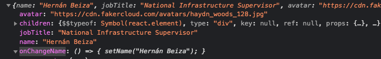
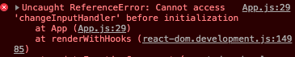

# Sección 5 - React Essentials - State

## 27 useState and Change of State 

- Importar useState
- Llamar a una función y usar setName("Nuevo nombre");
- Actualizará el state del componente hijo Cards

```jsx
import { useState } from 'react';

import './App.css';

import faker from 'faker';

import Card from './Card/Card';

function App() {
  const [name, setName] = useState("Alan Smith");

  const changeNameHandler = () => {
    setName("Hernán Beiza");
  }

  const buttonsMarkup = (
    <div>
    <button className="button button2">Yes</button>
    <button className="button button3">No</button>
    </div>
    )
    return (
    <div className="App">
    <button onClick={changeNameHandler}> Change Name</button>

    <Card 
      name={name} 
      jobTitle="National Infrastructure Supervisor" 
      avatar="https://cdn.fakercloud.com/avatars/haydn_woods_128.jpg">
    {buttonsMarkup}
    </Card>

    </div>
    );
  }

  export default App;
```


## 28 Passing Function to Component

- Pasar una función al componente hijo
- En el componente Padre, App

````jsx
import { useState } from 'react';

import './App.css';

import faker from 'faker';

import Card from './Card/Card';

function App() {
  const [name, setName] = useState("Alan Smith");

  const changeNameHandler = () => {
    setName("Hernán Beiza");
  }

  const buttonsMarkup = (
    <div>
    <button className="button button2">Yes</button>
    <button className="button button3">No</button>
    </div>
    )
    return (
    <div className="App">
    <button onClick={changeName}> Change Name</button>

    <Card 
      onChangeName={changeNameHandler} 
      name={name} 
      jobTitle="National Infrastructure Supervisor" 
      avatar="https://cdn.fakercloud.com/avatars/haydn_woods_128.jpg">
    {buttonsMarkup}
    </Card>

    </div>
    );
  }

  export default App;

````

- El copmponente hijo recibirá la función



- En el componente Card usar la función pasada via props

````jsx
import './Card.css';

function Card(props) {
  console.log(props);
  return (
    <div className="Card">
    <div className="card">
    
    <div className="container">
    <h4><b>{props.name}</b></h4>
    <p>{props.jobTitle}</p>
    <p>{props.children}</p>
    <p><button className="button" onClick={props.onChangeName}>Change name</button></p>
    </div>
    </div>
    </div>
    );
}

export default Card;

````

- Así se puede llamar a una función del Padre, App, desde el componente Hijo, Cards.
- Permite cambiar el state desde un componente hijo

### Error de infinite loop: "React limits the number of render to prevent an inifinite loop"

- Cuando la página se carga, ejecuta las funciones una y otra vez
- Este error pasa cuando se llama una y otra vez una función desde un componente
- Ejemplo del error: En el componente padre, App.js

````jsx
import { useState } from 'react';

import './App.css';

import faker from 'faker';

import Card from './Card/Card';

function App() {
  const [name, setName] = useState("Alan Smith");

  const changeNameHandler = (nombre) => {
    setName(nombre);
  }

  const buttonsMarkup = (
    <div>
    <button className="button button2">Yes</button>
    <button className="button button3">No</button>
    </div>
    )
    return (
    <div className="App">
    <button onClick={changeName("Marcus Miller")}> Change Name</button>

    <Card 
      onChangeName={changeNameHandler("Victor Wooten")} 
      name={name} 
      jobTitle="National Infrastructure Supervisor" 
      avatar="https://cdn.fakercloud.com/avatars/haydn_woods_128.jpg">
    {buttonsMarkup}
    </Card>

    </div>
    );
  }

  export default App;	
````

- Se está llamando una y otra vez la función changeName("Marcus Miller")

- Para resolver, hay que usar una función fatArrow en onClick del componente hijo para que solo se llama al hacer click

```jsx
import { useState } from 'react';

import './App.css';

import faker from 'faker';

import Card from './Card/Card';

function App() {
  const [name, setName] = useState("Alan Smith");

  const changeNameHandler = (nombre) => {
    setName(nombre);
  }

  const buttonsMarkup = (
    <div>
    <button className="button button2">Yes</button>
    <button className="button button3">No</button>
    </div>
    )
    return (
    <div className="App">
    <button onClick={()=>changeName("Marcus Miller")}> Change Name</button>

    <Card 
      onChangeName={()=>changeNameHandler("Victor Wooten")} 
      name={name} 
      jobTitle="National Infrastructure Supervisor" 
      avatar="https://cdn.fakercloud.com/avatars/haydn_woods_128.jpg">
    {buttonsMarkup}
    </Card>

    </div>
    );
  }

  export default App;
```

## 29 Two Way Binding

- Permite actualizar el valor en el modelo y la vista
- En el componente padre, se crea una función para cambiar el state

```jsx
import { useState } from 'react';

import './App.css';

import faker from 'faker';

import Card from './Card/Card';

function App() {
  const [name, setName] = useState("Alan Smith");

  const changeNameHandler = (nombre) => setName(nombre);

  const changeInputHandler = (event) => setName(event.target.value);

  const buttonsMarkup = (
    <div>
    <button className="button button2">Yes</button>
    <button className="button button3">No</button>
    </div>
    )
    return (
    <div className="App">
    <button onClick={()=>changeNameHandler("Marcus Miller")}> Change Name</button>

    <Card 
      onChangeName={()=>changeNameHandler("Victor Wooten")} 
      onChangeInput={changeInputHandler} 
      name={name} 
      jobTitle="National Infrastructure Supervisor" 
      avatar="https://cdn.fakercloud.com/avatars/haydn_woods_128.jpg">
    {buttonsMarkup}
    </Card>

    </div>
    );
  }

  export default App;
```

- En el componente hijo, se crea un Input y se usa la función handler pasada desde el padre

````jsx
import './Card.css';

function Card(props) {
  console.log(props);
  return (
    <div className="Card">
    <div className="card">
    
    <div className="container">
    <h4><b>{props.name}</b></h4>
    <p>{props.jobTitle}</p>
    <p>{props.children}</p>
    <p><input type="text" value={props.name} onChange={props.onChangeInput}/></p>
    <p><button className="button" onClick={props.onChangeName}>Change name</button></p>
    </div>
    </div>
    </div>
    );
}

export default Card;
````


- En el componente padre se crea una función para manejar los cambios de estado del input

## 30 Conditional rendering

- Ocultar o mostrar elementos condicionalmente
- En el componente padre se crea una función para manejar un flag para mostrar u ocultar la tarjeta

````jsx
import { useState } from 'react';

import './App.css';

import faker from 'faker';

import Card from './Card/Card';

function App() {
  const [name, setName] = useState("Alan Smith");
  const [showCard, setShowCard] = useState(true);

  const changeNameHandler = (nombre) => setName(nombre);

  const changeInputHandler = (event) => setName(event.target.value);

  const toggleShowCardHandler = () => setShowCard(!showCard);

  const buttonsMarkup = (
    <div>
    <button className="button button2">Yes</button>
    <button className="button button3">No</button>
    </div>
    )
  return (
    <div className="App">
    <button onClick={()=>toggleShowCardHandler()}>Toggle Show/Hide</button>
    </div>
    );
}

export default App;

````

- En el componente padre se usa una expresión ternaria para mostrar u ocultar la tarjeta

````jsx
import { useState } from 'react';

import './App.css';

import faker from 'faker';

import Card from './Card/Card';

function App() {
  const [name, setName] = useState("Alan Smith");
  const [showCard, setShowCard] = useState(true);

  const changeNameHandler = (nombre) => setName(nombre);

  const changeInputHandler = (event) => setName(event.target.value);

  const toggleShowCardHandler = () => setShowCard(!showCard);

  const buttonsMarkup = (
    <div>
    <button className="button button2">Yes</button>
    <button className="button button3">No</button>
    </div>
    )
  return (
    <div className="App">
    <button onClick={()=>toggleShowCardHandler()}>Toggle Show/Hide</button>
    {showCard? 
      <Card
        onChangeName={()=>changeNameHandler("Victor Wooten")}
        onChangeInput={changeInputHandler}
        name={name} 
        jobTitle="National Infrastructure Supervisor" 
        avatar="https://cdn.fakercloud.com/avatars/haydn_woods_128.jpg">
      {buttonsMarkup}
      </Card>
      :null
    }
    </div>
    );
}

export default App;
````

- OPtra forma de escribir sin :null

```jsx
import { useState } from 'react';

import './App.css';

import faker from 'faker';

import Card from './Card/Card';

function App() {
  const [name, setName] = useState("Alan Smith");
  const [showCard, setShowCard] = useState(true);

  const changeNameHandler = (nombre) => setName(nombre);

  const changeInputHandler = (event) => setName(event.target.value);

  const toggleShowCardHandler = () => setShowCard(!showCard);

  const buttonsMarkup = (
    <div>
    <button className="button button2">Yes</button>
    <button className="button button3">No</button>
    </div>
    )
  return (
    <div className="App">
    <button onClick={()=>toggleShowCardHandler()}>Toggle Show/Hide</button>
    {showCard &&
      <Card 
      onChangeName={()=>changeNameHandler("Victor Wooten")} 
      onChangeInput={changeInputHandler} 
      name={name} 
      jobTitle="National Infrastructure Supervisor" avatar="https://cdn.fakercloud.com/avatars/haydn_woods_128.jpg">
      {buttonsMarkup}
      </Card>}
    </div>
    );
}

export default App;

```

### Versión más limpia del código

- En el componente padre, App.js, se crea una constante, variable, para guardar el markup a mostrar u ocultar

````jsx
import { useState } from 'react';

import './App.css';

import faker from 'faker';

import Card from './Card/Card';

function App() {
  const [name, setName] = useState("Alan Smith");
  const [showCard, setShowCard] = useState(true);

  const changeNameHandler = (nombre) => setName(nombre);

  const changeInputHandler = (event) => setName(event.target.value);

  const toggleShowCardHandler = () => setShowCard(!showCard);

  const buttonsMarkup = (
    <div>
    <button className="button button2">Yes</button>
    <button className="button button3">No</button>
    </div>
    )

  const cardMarkup = (
    showCard &&
    <Card 
    onChangeName={()=>changeNameHandler("Victor Wooten")} 
    onChangeInput={changeInputHandler} 
    name={name} 
    jobTitle="National Infrastructure Supervisor" avatar="https://cdn.fakercloud.com/avatars/haydn_woods_128.jpg">
    {buttonsMarkup}
    </Card>
  )
  return (
    <div className="App">
    <button onClick={()=>toggleShowCardHandler()}>Toggle Show/Hide</button>
    {cardMarkup}
    </div>
    );
}

export default App;

````

- Para esto es necesario tener en cuenta que al mover a una variable, const, no se debe usar "{}" ya que se está escribiendo código javascript.
- "{}" se usa para escribir template en el área de JSX
- Las funciones usadas en el template deben estar definidas antes que la variable que contiene el markup que las llama, usa, sino saldrá un error. 
- Ejemplo de código erróneo:

```jsx
import { useState } from 'react';

import './App.css';

import faker from 'faker';

import Card from './Card/Card';

function App() {
  const [name, setName] = useState("Alan Smith");
  const [showCard, setShowCard] = useState(true);


  const buttonsMarkup = (
    <div>
    <button className="button button2">Yes</button>
    <button className="button button3">No</button>
    </div>
    )

  const cardMarkup = (
    showCard &&
    <Card 
    onChangeName={()=>changeNameHandler("Victor Wooten")} 
    onChangeInput={changeInputHandler} 
    name={name} 
    jobTitle="National Infrastructure Supervisor" avatar="https://cdn.fakercloud.com/avatars/haydn_woods_128.jpg">
    {buttonsMarkup}
    </Card>
    )

  const changeNameHandler = (nombre) => setName(nombre);

  const changeInputHandler = (event) => setName(event.target.value);

  const toggleShowCardHandler = () => setShowCard(!showCard);

  return (
    <div className="App">
    <button onClick={()=>toggleShowCardHandler()}>Toggle Show/Hide</button>
    {cardMarkup}
    </div>
    );
}

export default App;

```


- Ejemplo de error:


