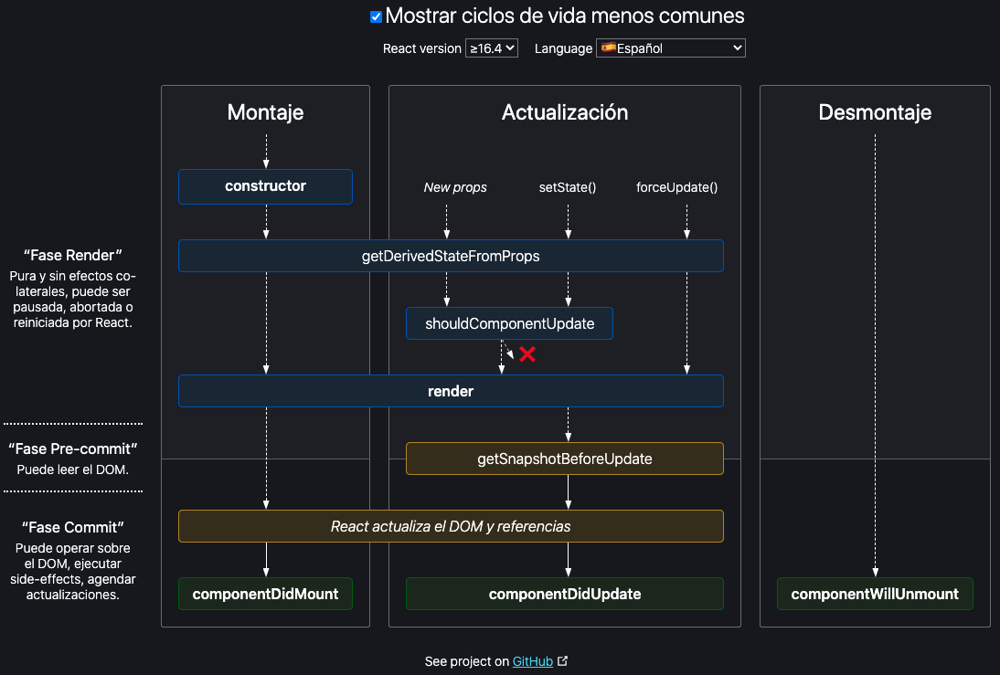

# 08 - React Essentials - Lifecycle and useEffect

## 40 Convert functional base to class base

- class
- constructor recibe el props del componente
- En clases no se usa useEffect
- En la funcíon render va el código de la vista
- El componente App como clase queda así:

````jsx
import { Component } from 'react';

import './App.css';

import { ThemeProvider } from 'styled-components';

import Card from './Card/Card';
import Button from './element/Button';

const theme = {
  primary: '#4CAF50',
  mango:'yellow'
}

class App extends Component {

  constructor(props){    
    super(props);
    this.state = {
      cards:[
      { id:100, name:"Victor", title:"National Infrastructure Supervisor", avatar:"https://cdn.fakercloud.com/avatars/haydn_woods_128.jpg" },
      { id:200,  name:"Marcus", title:"National Infrastructure Supervisor", avatar:"https://cdn.fakercloud.com/avatars/haydn_woods_128.jpg" },
      { id:300,  name:"Jaco", title:"National Infrastructure Supervisor", avatar:"https://cdn.fakercloud.com/avatars/haydn_woods_128.jpg" }
      ],
      showCard:true
    }
  }

  toggleShowCardHandler () { this.setState({showCard:!this.state.showCard})};

  deleteCardHandler (cardIndice) {
    //Es necesario ... para poder re renderar la vista
    const cardsCopy = [...this.state.cards];
    cardsCopy.splice(cardIndice,1);
    this.setState({cards:cardsCopy});
  }

  changeNameHandler (event,cardIndice) {
    //1 Obtener la tarjeta a modificar
    const indexEncontrado = this.state.cards.findIndex(itemCard=>itemCard.id==cardIndice);
    //2 Crear una copia de las tarjetas
    const cardsCopy = [...this.state.cards];
    //3 Cambiar el nombre de la tarjeta
    cardsCopy[indexEncontrado].name = event.target.value;
    //4 Actualizar tarjetas
    this.setState({cards:cardsCopy});
  }

  render(){
    const buttonsMarkup = (
      <div>
      <button className="button button2">Yes</button>
      <button className="button button3">No</button>
      </div>
      )

    const classes = ["button"];

    if (this.state.cards.length<3) classes.push("pink");
    if (this.state.cards.length<2) classes.push("red");  

    const cardMarkup = (
      this.state.showCard && (
        this.state.cards.map ((card,index)=><Card 
          name={card.name} 
          jobTitle={card.title} 
          avatar={card.avatar}
          key ={card.id}
          onDelete={() => this.deleteCardHandler(index)}
          onChangeName={(event) => this.changeNameHandler(event,card.id)}
          />
          )
        )
      )
    return (
      <ThemeProvider theme={theme}>
      <div className="App">
      <Button color="primary" length={this.state.cards.length}>Toggle</Button>
      <button className={classes.join(" ")} onClick={()=>this.toggleShowCardHandler()}>Toggle Show/Hide</button>
      {cardMarkup}
      </div>
      </ThemeProvider>
    ); 
  }
}

export default App;
````


## 41 Convert Card component to class base component

- props: Parámetros pasados desde otro componente
- state: Atributos de la clase
- El componente queda así

````jsx
import { Component } from 'react';

import './Card.css';

class Card extends Component {

  constructor(props){
    super(props);
  }

  render(){
    console.log(this.props);
    return (
      <div className="Card">
      <div className="card">
      
      <div className="container">
      <h4><b>{this.props.name}</b></h4>
      <p>{this.props.jobTitle}</p>
      <p><input type="text" onChange={this.props.onChangeName} value={this.props.name}/></p>
      <p><button onClick ={this.props.onDelete} className="button button-red">Delete</button></p>
      </div>
      </div>
      </div>
      );    
  }
}

export default Card;
````


## 42 Life Cycle Methods Diagram

- https://projects.wojtekmaj.pl/react-lifecycle-methods-diagram/



- https://es.reactjs.org/docs/react-component.html

## 43 React lifecycle - mounting

### mounting: Montaje

- Tener en consideración que en dev builds el llamado a los métodos puede ser erróneo
- Se recomienda usar npm run build

##### constructor

- No llamar a setState
- El único lugar en dónde se puede manipular, definir, el state del componente sin usar setState

##### static getDerivedStateFromProps(props,state)

- Usado para actualizar el state, estado interno, como resultado de cambios de props, parámetros pasados al componente desde otro

##### render

- Dibujado del componente
- No se puede usar setState
- Mantenerlo puro

##### componentDidMount

- Usado para realizar llamados a APIs
- Usado para realizar subscripciones, no olvidar desubscribirse

## 44 React lifecycle - updating

### update: Crecimiento

##### shouldComponentUpdate(nextProps, nextState)

- Usa `shouldComponentUpdate()` para avisar a React si la salida de un componente no se ve afectada por el cambio actual en el estado o los accesorios. 
- No es usado por el renderizado inicial o forceupdate
- return true por defecto
- Permite condicionar el actualizado y renderizado

#####   getSnapshotBeforeUpdate(prevProps, prevState) 

- `getSnapshotBeforeUpdate()` se invoca justo antes de que la salida renderizada más reciente se entregue, por ejemplo, al DOM. 
- Permite al componente capturar cierta información del DOM (por ejemplo, la posición del scroll) antes de que potencialmente se cambie. 
- Cualquier valor que se devuelva en este método de ciclo de vida se pasará como parámetro a `componentDidUpdate()`.

##### componentDidUpdate

- Llamado inmediatamente después de que la actualización ocurra. 
- Este método no es llamado para el renderizador inicial.
- Usado para realizar llamadas a APIs
- Tener cuidado con el cambio de state porque se puede crear un loop

## 45 React lifecycle - unmounting

### unmounting: Destrucción

#### componentWillUnmount

- Permite eliminar la subscripción del componente a renderizados del padre
- Se invoca inmediatamente antes de desmontar y destruir un componente. 
- Usado para realizar las tareas de limpieza tales como invalidación de temporizadores, la cancelación de solicitudes de red o la eliminación de las suscripciones que se crearon en `componentDidMount()`.
- No se debe llamar a setState porque el componente es desmontado

## 46 useEffect

- Usado en componentes funcionales para implementar el ciclo de vida 
- hooks
-  Si el arreglo de dependencias no va definido se llamará siempre en cada cambio
- Si el arreglo de dependencias va vacío se llamará una vez

````jsx
useEffect(()=>{
  console.log("App: useEffect");
},[]);
````

- Si al arreglo de dependencias se le pasa una variable, observará esa variable

````jsx
//Si el arreglo de dependencias está vacío se llamará siempre en cada cambio
  useEffect(()=>{
    console.log("App: useEffect");
  },[cards]);
````

## 47 useEffect clean up

- Hay que eliminar subscripciones una vez que el componente desaparece
- useEffect puede retornar una función encargada de limpiar y desubscribirse

```jsx
import{ useEffect, useState } from 'react';

import './Card.css';

function Card(props) {

  const [x,setX] = useState(0);
  const [y,setY] = useState(0);
  
  const recordMouse = e => {
    console.log("recordMouse",e);
    setX(e.clientX);
    setY(e.clientY);
  }

  useEffect(()=>{
    window.addEventListener("mousemove",recordMouse);
    return () => {
      console.log("Card: useEffect cleanUp")
      window.removeEventListener("mousemove",recordMouse);
    }
  },[]);

  return (
    <div className="Card">
    <div className="card">
    
    <div className="container">
    <h4><b>{props.name}</b></h4>
    <p>{props.jobTitle}</p>
    <p>x pos: {x} y pos: {y}</p>
    <p><input type="text" onChange={props.onChangeName} value={props.name}/></p>
    <p><button onClick ={props.onDelete} className="button button-red">Delete</button></p>
    </div>
    </div>
    </div>
    );
}

export default Card;

```

